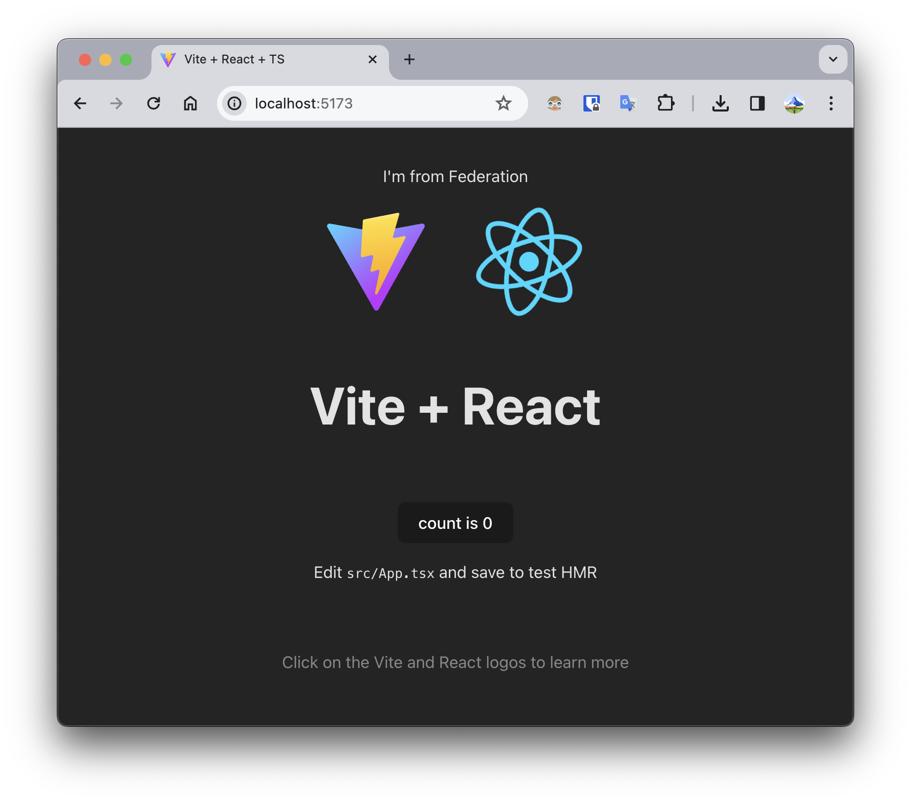

# module-federation-vite
 Example Module Federation Vite

Based on the [`vite-federation-plugin`](https://github.com/originjs/vite-plugin-federation/tree/main). Uses two simple frontends based on `create-vite`:

- [`remote`](/federation-vite-remote) to provide a micro-frontend
- [`host`](/federation-vite-host) to consume a micro-frontend

The micro-frontend component is a simple `Federated` text span.

To run the example:

- navigate to the [`remote`](/federation-vite-remote)
- run `yarn` to install all dependencies
- run `yarn build` to build the remote (**required**)
- host the remote with the `yarn dlx http-server ./dist --cors` (CORS required)
- navigate to the [`host`](/federation-vite-host)
- run `yarn`
- run `yarn dev` to start development server
- in the browser navigate to the `http://localhost:5173`
- you should see the example Vite App with an additional component printing `I'm from Federation`

